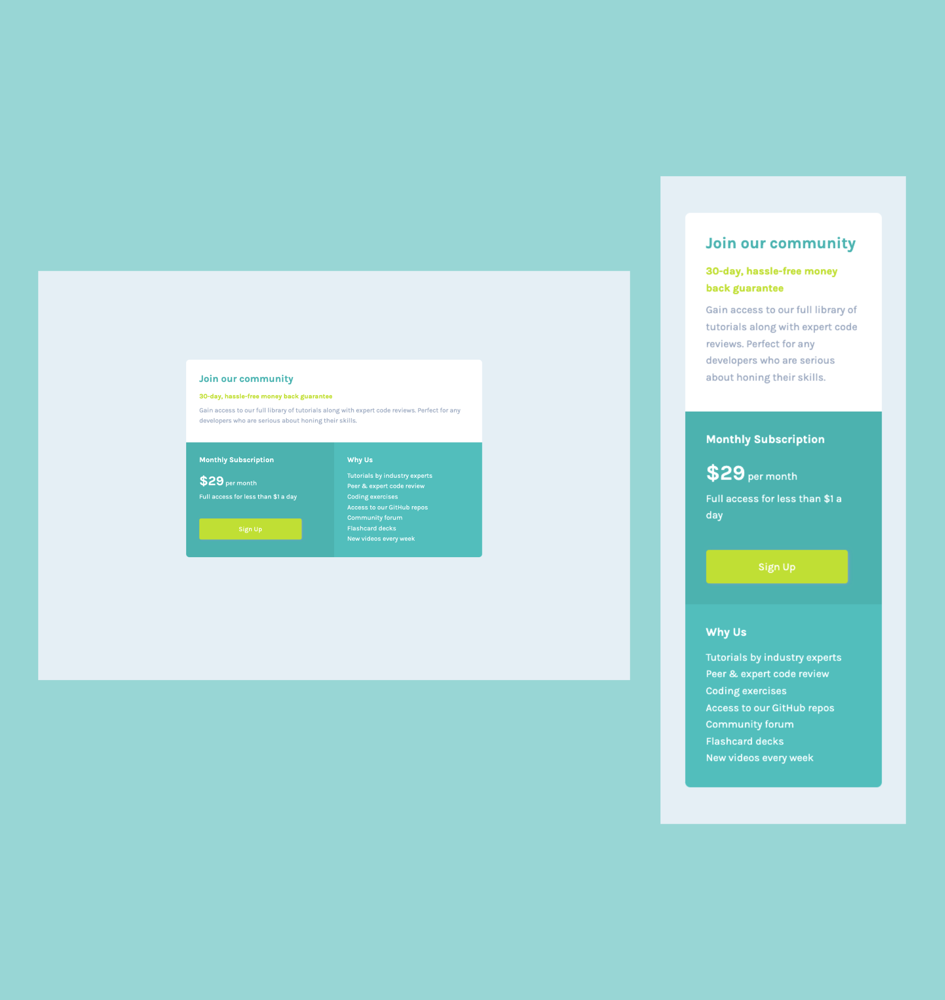

# Frontend Mentor - Single price grid component solution

This is a solution to the [Single price grid component challenge on Frontend Mentor](https://www.frontendmentor.io/challenges/single-price-grid-component-5ce41129d0ff452fec5abbbc). Frontend Mentor challenges help you improve your coding skills by building realistic projects. 

## Table of contents

- [Overview](#overview)
  - [The challenge](#the-challenge)
  - [Screenshot](#screenshot)
  - [Links](#links)
- [My process](#my-process)
  - [Built with](#built-with)
  - [What I learned](#what-i-learned)
  - [Continued development](#continued-development)
- [Author](#author)
- [Acknowledgments](#acknowledgments)

## Overview

### The challenge

Users should be able to:

- View the optimal layout for the component depending on their device's screen size
- See a hover state on desktop for the Sign Up call-to-action

### Screenshot




### Links

- Solution URL: [Check out my solution](https://www.frontendmentor.io/solutions/single-price-grid-component-LOxUgVmHEl)
- Live Site URL: [Check out my live site](https://omowunmikamil.github.io/single-price-grid-component.github.io/)

## My process

### Built with

- Semantic HTML5 markup
- CSS custom properties
- Flexbox
- CSS Grid
- Mobile-first workflow (Responsive for all devices)

### What I learned

```html
<h1>Some HTML code I'm proud of</h1>
<main class="flex-container">
</main>
<section>
</section>
<article class="flex-item item-1">
</article>
<p class="yellow">30-day, hassle-free money back guarantee</p>
<p><span>&dollar;29</span> per month</p>
<button class="btn">Sign Up</button>
```
```css
:root {
  /* ### Primary */

  --cyan: hsl(179, 62%, 43%);
  --bright-yellow: hsl(71, 73%, 54%);

  /* ### Neutral */

  --light-gray: hsl(204, 43%, 93%);
  --grayish-blue: hsl(218, 22%, 67%);
}

.flex-container {
  background-color: #fff;
  width: 50%;
  margin: 15% auto;
  border-radius: 8px;
}

.flex-container > article:first-child {
  padding: 2rem;
}

.flex-container > article:first-child h1 {
  color: var(--cyan);
  margin-bottom: 1rem;
}

.flex-container > article:first-child p {
  margin-bottom: 0.50rem;
}

.flex-container > article:first-child p:last-child {
  color: var(--grayish-blue);
}

.btn {
  color: #fff;
  font-family: inherit;
  font-size: 1rem;
  background-color: var(--bright-yellow);
  padding: 1rem 6rem;
  margin-top: 2.5rem;
  border: none;
  outline: none;
  border-radius: 4px;
  box-shadow: 3px 2px 6px var(--grayish-blue);
  cursor: pointer;
}

.btn:hover {
  border: 2px solid hsl(71, 73%, 54%);
  background-color: hsl(70, 51%, 56%);
}

.flex-container > section article:first-child {
  background-color: var(--cyan);
  border-radius: 0 0 0 8px;
  flex-basis: 50%;
  color: #fff;
}

.flex-container > section article:nth-child(2) {
  background-color: hsl(179, 52%, 49%);
  border-radius: 0 0 8px 0;
  flex-basis: 50%;
  color: #fff;
}

@media screen and (max-width: 375px) {
  .flex-container > section article:nth-child(2) {
    border-radius: 0 0 8px 8px;
  }
}
```

### Continued development

I will like to continue learning and working with the CSS variable and class selector for better understanding.

## Author

- Website - [Visit my Portfolio Website](https://omowunmikamil.tech)
- Frontend Mentor - [Omowunmi Kamiludeen](https://www.frontendmentor.io/profile/Omowunmikamil)
- Twitter - [Browser_Nerd](https://www.twitter.com/@Browser_Nerd)

## Acknowledgments
- **Frontend Mentor** - for making this challenge available.
